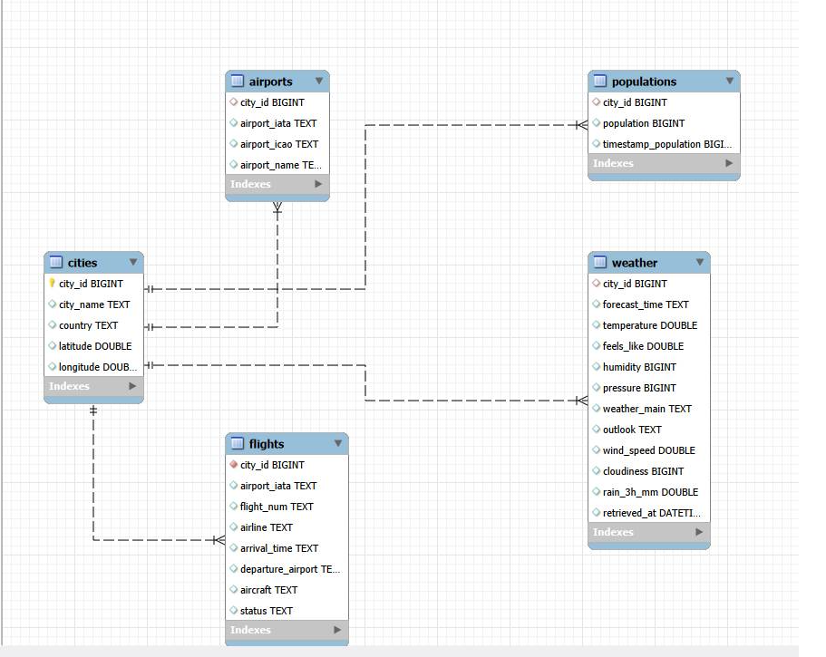
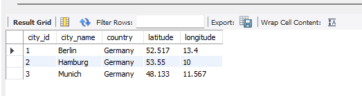
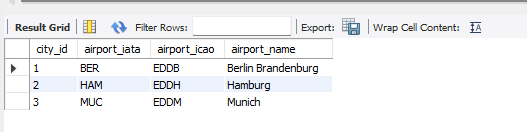
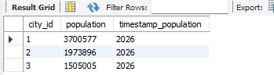
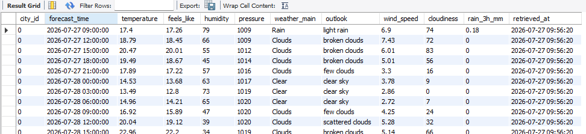
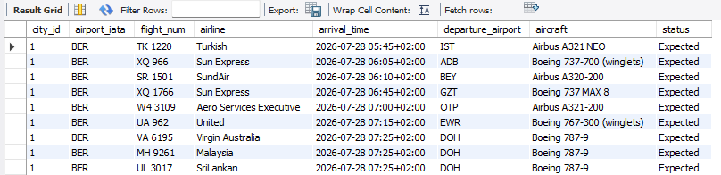

# 🛴 Gans E-Scooter Share – ETL Pipeline

## Project Overview

This project was completed as part of the **WBS Coding School Data Analytics Bootcamp**.

The goal was to build an **ETL (Extract, Transform, Load) pipeline** for **Gans**, a fictional e-scooter sharing company. Gans aims to optimize the distribution of its e-scooters by collecting external data that influences customer demand, such as weather conditions, population data, and incoming flights.

The pipeline automatically extracts data from multiple sources, transforms it into a clean and structured format, and loads it into a **MySQL relational database** for future analysis and predictive modelling.

---

# Tech Stack

- Python
- Jupyter Notebook (Anaconda)
- Pandas
- Requests
- BeautifulSoup
- Datetime
- SQLAlchemy
- PyMySQL
- MySQL Workbench

### APIs Used

- OpenWeatherMap API
- AeroDataBox API (RapidAPI)

---

# ETL Pipeline

## Extract

Data is collected from three different sources.

### Web Scraping

Wikipedia pages were scraped to collect:

- City names
- Country
- Population
- Latitude
- Longitude

### Weather API

The OpenWeatherMap Forecast API retrieves a **5-day weather forecast** in **3-hour intervals** using each city's latitude and longitude.

Collected information includes:

- Temperature
- Humidity
- Weather conditions
- Wind speed
- Cloud coverage
- Rainfall
- Forecast timestamp

### Flights API

The AeroDataBox API retrieves **scheduled flight arrivals for the following day**.

The pipeline automatically calculates tomorrow's date using Python's `datetime` module and requests flight data in **two 12-hour intervals** while respecting the API rate limits using `time.sleep()`.

Collected information includes:

- Flight number
- Airline
- Arrival airport
- Departure airport
- Arrival time
- Aircraft model
- Flight status

---

## Transform

The extracted data is cleaned and transformed before being stored.

Transformations include:

- Converting geographic coordinates into decimal format
- Parsing nested JSON responses
- Handling missing values using `.get()`
- Formatting timestamps
- Creating structured Pandas DataFrames
- Preventing API rate-limit errors using request delays

---

## Load

The cleaned datasets are loaded into a MySQL database using **SQLAlchemy** and **Pandas `to_sql()`**.

The project stores data in multiple relational tables:

- **cities** – static city information
- **populations** – population data
- **weather** – weather forecasts
- **airports** – airport metadata
- **flights** – scheduled arrivals

The tables share a common `city_id`, allowing the datasets to be joined for analysis and future development of predictive models.

---

# Database Design

The project stores the collected data in a relational MySQL database. Separate tables are used for cities, populations, weather forecasts, airports, and flights. The datasets share a common `city_id`, making it possible to combine information from different sources for further analysis.

## Entity Relationship Diagram

The database stores static city information together with dynamic weather forecasts, flight arrivals, airport information, and population data. The tables are designed so that they can be joined using `city_id`.

---

## Database Tables

### Cities

Stores the list of cities together with their country and geographic coordinates.

---

### Airports

Contains airport information (IATA code, ICAO code and airport name) for each city.

---

### Population

Stores the latest population data collected from Wikipedia.

---

### Weather

Contains 5-day weather forecasts in 3-hour intervals retrieved from the OpenWeather API.

---

### Flights

Contains scheduled arrival flights collected from the AeroDataBox API, including airline, flight number, departure airport, aircraft type and status.

---

# Challenges & Solutions

### API Rate Limits

The AeroDataBox API only allows requests covering **12-hour periods** and limits request frequency.

To solve this:

- Split each day into two 12-hour requests
- Added `time.sleep()` between requests to avoid HTTP 429 errors

---

### Working with Nested JSON

Both APIs returned deeply nested JSON objects.

Using chained `.get()` methods prevented errors when optional values were missing and made the data extraction process more robust.

---

### Database Integration

The project combines data collected from web scraping and multiple APIs into a single relational database.

Using a common `city_id` across the datasets makes it possible to join weather forecasts, population data, airport information, and flight arrivals for each city.

---

# Skills Demonstrated

- ETL Pipeline Development
- Web Scraping with BeautifulSoup
- REST API Integration
- Data Cleaning & Transformation
- Pandas
- SQL
- MySQL Database Design
- SQLAlchemy
- Python Automation
- Working with JSON Data

---

# Future Improvements

Possible future extensions include:

- Automating the ETL pipeline using scheduled jobs (Cron or Windows Task Scheduler)
- Collecting historical weather and flight data over longer periods
- Adding additional external data sources
- Creating dashboards with Power BI or Tableau
- Developing predictive models to forecast scooter demand

---

# Author

Created as part of the **WBS Coding School Data Analytics Bootcamp** to demonstrate practical skills in:

- Python
- SQL
- Web Scraping
- REST APIs
- ETL Pipelines
- Relational Database Design
